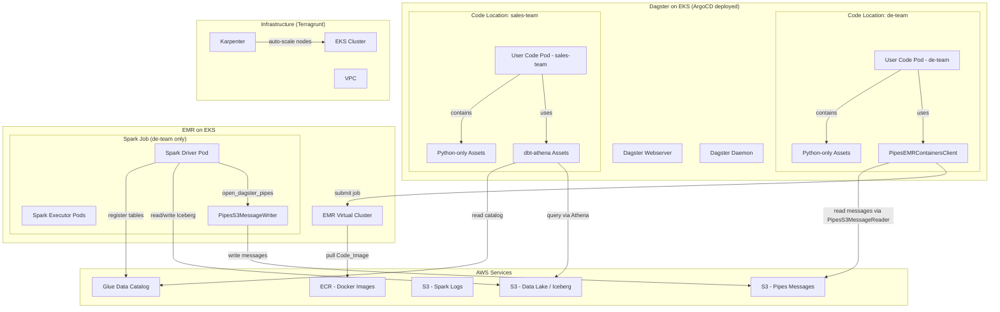
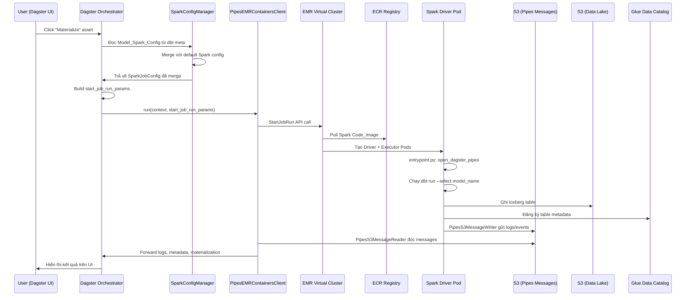
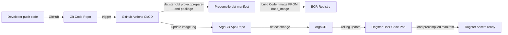
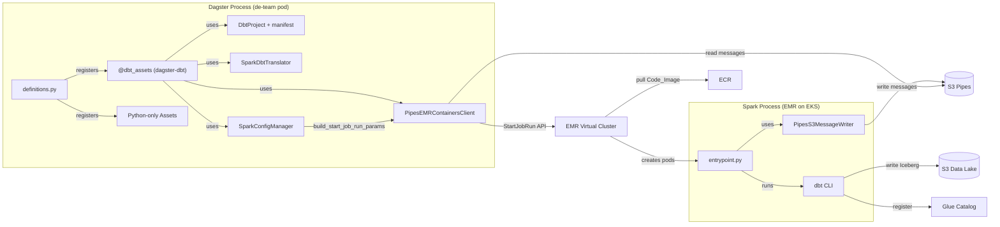
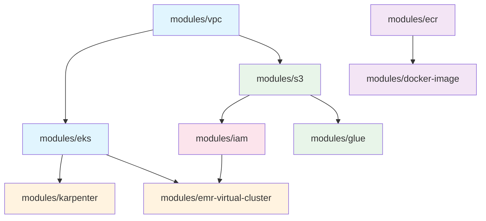

# Design Document: dbt-dagster-lakehouse

## Overview

Hệ thống dbt-dagster-lakehouse tích hợp dbt với Dagster trên kiến trúc Lakehouse, cho phép mỗi dbt model được ánh xạ thành một Dagster asset và thực thi trên Apache Spark thông qua EMR on EKS. Thiết kế tập trung vào ba trụ cột chính:

1. **Orchestration Layer**: Dagster đóng vai trò orchestrator, sử dụng `PipesEMRContainersClient` từ `dagster-aws` để submit và giám sát Spark job trên EMR on EKS. Mỗi dbt model được ánh xạ 1:1 thành Dagster asset, giữ nguyên dependency graph từ dbt. Hệ thống hỗ trợ 2 code locations theo team (`de-team` dùng dbt-spark, `sales-team` dùng dbt-athena) với isolation hoàn toàn về dependencies và deployment.

2. **Compute Layer**: Spark job chạy trên EMR on EKS với Docker image theo pattern **Base Image + Code Image**. Base Image chứa runtime + tất cả dependencies (Spark, dbt-core, dbt-spark, dagster-pipes, boto3, Iceberg JARs). Code Image `FROM Base_Image` chỉ `COPY` code dbt/Dagster project vào — build nhanh (<30s), không phát sinh vulnerability mới. Entry point (`local:///app/entrypoint.py`) được bake sẵn trong image.

3. **Infrastructure Layer**: Hạ tầng AWS (VPC, EKS, Karpenter, EMR Virtual Cluster, ECR, S3, IAM, Glue) được quản lý bằng Terraform modules + Terragrunt theo pattern từ [terragrunt-ecs-msk-connect-stask](https://github.com/thanhtt-demo/terragrunt-ecs-msk-connect-stask). Dagster và platform components được deploy lên EKS qua ArgoCD theo App-of-Apps pattern từ [argocd-spark-operator](https://github.com/thanhtt-demo/argocd-spark-operator).

### Quyết định thiết kế chính

| Quyết định | Lựa chọn | Lý do |
|---|---|---|
| Dagster ↔ dbt integration | `@dbt_assets` decorator + `DbtProject` + `DbtCliResource` từ `dagster-dbt` | API chính thức, tự động parse manifest, tạo assets với dependency graph, hỗ trợ asset checks từ dbt tests. Ref: [dagster-dbt reference](https://docs.dagster.io/integrations/libraries/dbt/reference) |
| dbt-spark connection | `method: session` — dbt-spark kết nối trực tiếp SparkSession trong cùng process | Đơn giản nhất, không cần Thrift server, nhanh hơn (in-process), ít moving parts. Ta kiểm soát hoàn toàn Spark environment trên EMR on EKS |
| Dagster ↔ Spark communication | Dagster Pipes (`PipesEMRContainersClient` + `PipesS3MessageReader/Writer`) | Tận dụng thư viện có sẵn trong dagster-aws, nhận logs/events streaming từ Spark. Ref: [Dagster Pipes EMR Containers](https://docs.dagster.io/integrations/external-pipelines/aws/aws-emr-containers-pipeline) |
| dbt manifest generation | Build time (CI/CD) via `dagster-dbt project prepare-and-package` | Tránh overhead recompile dbt project mỗi lần Dagster code load. Manifest được precompile và đóng gói vào Code_Image |
| Code delivery | Base Image + Code Image pattern, code bake vào image | Build nhanh (<30s), không phát sinh vuln mới, mỗi team có Base Image riêng |
| Table format | Apache Iceberg + Glue Data Catalog | ACID transactions, time travel, schema evolution |
| IaC | Terraform modules + Terragrunt orchestration | DRY, multi-environment, remote state management |
| GitOps | ArgoCD App-of-Apps pattern (Helm-based) | Single source of truth, auto-sync, ordered deployment via sync waves |
| Node scaling | Karpenter | Nhanh hơn Cluster Autoscaler, hỗ trợ Spot/On-Demand mix cho driver/executor |
| Team isolation | 2 Dagster Code Locations (de-team, sales-team) | Dependencies riêng, deploy độc lập, lỗi không ảnh hưởng lẫn nhau |

## Architecture

### Tổng quan kiến trúc



### Luồng thực thi khi Materialize một dbt Asset (de-team)



### CI/CD Flow



### Repository Structure

Hệ thống sử dụng 3 Git repositories:

```
# Repo 1: Infrastructure (Terragrunt + Terraform)
# Pattern theo: https://github.com/thanhtt-demo/terragrunt-ecs-msk-connect-stask
infra/
├── _envcommon/                    # Shared module configs
│   ├── vpc.hcl
│   ├── eks.hcl
│   ├── karpenter.hcl
│   ├── emr-virtual-cluster.hcl
│   ├── ecr.hcl
│   ├── s3.hcl
│   ├── iam.hcl
│   └── glue.hcl
├── modules/                       # Terraform modules
│   ├── vpc/
│   ├── eks/
│   ├── karpenter/
│   ├── emr-virtual-cluster/
│   ├── ecr/
│   ├── s3/
│   ├── iam/
│   ├── glue/
│   └── docker-image/              # Build & push Base_Image
├── non-prod/
│   └── {account}/
│       └── {region}/
│           ├── env.hcl            # aws_account_id, aws_profile
│           ├── vpc/
│           │   └── terragrunt.hcl
│           ├── eks/
│           │   └── terragrunt.hcl
│           ├── karpenter/
│           │   └── terragrunt.hcl
│           ├── emr-virtual-cluster/
│           │   └── terragrunt.hcl
│           ├── ecr/
│           │   └── terragrunt.hcl
│           ├── s3/
│           │   └── terragrunt.hcl
│           ├── iam/
│           │   └── terragrunt.hcl
│           └── glue/
│               └── terragrunt.hcl
└── terragrunt.hcl                 # Root config: remote state (S3 + DynamoDB), provider

# Repo 2: ArgoCD Apps (Kubernetes manifests + Helm charts)
# Pattern theo: https://github.com/thanhtt-demo/argocd-spark-operator
argocd/
├── app-of-apps.yaml               # Bootstrap: apply once to deploy everything
├── apps/                           # Root App-of-Apps Helm chart
│   ├── Chart.yaml
│   ├── values.yaml                 # Single source of truth cho tất cả applications
│   └── templates/
│       ├── applications.yaml       # Loop over values → ArgoCD Application CRDs
│       └── project.yaml            # ArgoCD AppProject
├── dagster/                        # Dagster umbrella Helm chart (sync-wave: 2)
│   ├── Chart.yaml                  # dependency: official dagster Helm chart
│   └── values.yaml                 # 2 userCodeDeployments: de-team, sales-team
└── namespaces/                     # Namespace manifests (sync-wave: 1)
    ├── dagster-ns.yaml
    └── spark-ns.yaml

# Repo 3: Application Code (dbt + Dagster)
dbt-dagster-project/
├── de-team/                        # Code location: de-team
│   ├── dagster_project/
│   │   ├── __init__.py
│   │   ├── definitions.py          # Dagster Definitions
│   │   ├── assets/
│   │   │   ├── __init__.py
│   │   │   ├── dbt_assets.py       # dbt-spark assets (EMR on EKS)
│   │   │   └── python_assets.py    # Python-only assets
│   │   ├── resources/
│   │   │   └── __init__.py         # PipesEMRContainersClient config
│   │   └── utils/
│   │       └── spark_config.py     # SparkConfigManager
│   ├── dbt_project/
│   │   ├── dbt_project.yml
│   │   ├── profiles.yml
│   │   ├── models/
│   │   │   ├── staging/
│   │   │   ├── intermediate/
│   │   │   └── marts/
│   │   └── macros/
│   ├── spark_entrypoint/
│   │   └── entrypoint.py           # local:///app/entrypoint.py
│   ├── Dockerfile.base             # Base Image: Spark + dbt-spark + deps
│   └── Dockerfile.code             # Code Image: FROM Base_Image + COPY code
├── sales-team/                     # Code location: sales-team
│   ├── dagster_project/
│   │   ├── __init__.py
│   │   ├── definitions.py
│   │   ├── assets/
│   │   │   ├── __init__.py
│   │   │   ├── dbt_assets.py       # dbt-athena assets (Athena queries)
│   │   │   └── python_assets.py
│   │   └── resources/
│   │       └── __init__.py
│   ├── dbt_project/
│   │   ├── dbt_project.yml
│   │   ├── profiles.yml
│   │   └── models/
│   ├── Dockerfile.base             # Base Image: dbt-athena + deps (KHÁC de-team)
│   └── Dockerfile.code             # Code Image: FROM Base_Image + COPY code
├── .github/
│   └── workflows/
│       └── ci-cd.yml               # GitHub Actions: build Code_Image → update ArgoCD repo
└── tests/
    ├── unit/
    │   ├── test_spark_config.py
    │   └── test_dbt_parser.py
    └── property/
        └── test_spark_config_properties.py
```

## Components and Interfaces

### 1. SparkConfigManager (`de-team/dagster_project/utils/spark_config.py`)

Quản lý merge logic giữa default Spark config và per-model config. Đây là component thuần logic, không phụ thuộc external service.

```python
from dataclasses import dataclass, field
from typing import Optional

@dataclass
class SparkResourceConfig:
    """Cấu hình tài nguyên Spark cho một dbt model."""
    driver_cpu: str = "1"
    driver_memory: str = "2g"
    executor_cpu: str = "1"
    executor_memory: str = "4g"
    executor_instances: int = 2

@dataclass
class SparkJobConfig:
    """Cấu hình đầy đủ cho một Spark job."""
    resources: SparkResourceConfig
    spark_properties: dict[str, str] = field(default_factory=dict)

class SparkConfigManager:
    """Merge per-model config với default config.
    
    Quy tắc merge:
    - Model config có độ ưu tiên cao hơn default config
    - Chỉ override các field được định nghĩa trong model meta
    - Field không có trong model meta → giữ giá trị default
    """
    
    def __init__(self, default_config: SparkJobConfig):
        self.default_config = default_config
    
    def merge_config(self, model_meta: dict | None) -> SparkJobConfig:
        """Merge model meta spark config với default.
        
        Args:
            model_meta: dict từ dbt model meta.spark_config, có thể None hoặc partial
            
        Returns:
            SparkJobConfig đã merge, model values ưu tiên hơn default
        """
        ...
    
    def build_start_job_run_params(
        self,
        config: SparkJobConfig,
        virtual_cluster_id: str,
        execution_role_arn: str,
        image_uri: str,
        release_label: str = "emr-7.5.0-latest",
        run_id: str = "",
    ) -> dict:
        """Tạo start_job_run_params cho PipesEMRContainersClient.run().
        
        Returns:
            dict chứa releaseLabel, virtualClusterId, executionRoleArn,
            jobDriver.sparkSubmitJobDriver với entryPoint và sparkSubmitParameters
        """
        ...
```

### 2. dbt Assets Definition (`de-team/dagster_project/assets/dbt_assets.py`)

Sử dụng `@dbt_assets` decorator và `DbtProject` từ `dagster-dbt` — API chính thức để tạo Dagster assets từ dbt manifest. Mỗi dbt model tự động thành 1 Dagster asset với dependency graph bảo toàn. dbt tests tự động thành asset checks.

Khi materialize, thay vì chạy `dbt.cli()` trực tiếp trên Dagster pod, asset sẽ submit Spark job lên EMR on EKS qua `PipesEMRContainersClient`. Spark pod chạy `dbt build` (bao gồm run + test) để giữ đầy đủ dbt features: incremental models, tests, snapshots, hooks, macros.

**Quan trọng — Tại sao không dùng `dbt.cli()` trực tiếp:**
- `dbt.cli()` chạy dbt trên Dagster user code pod (local Python process)
- dbt-spark cần Spark runtime → phải chạy trên Spark pod (EMR on EKS)
- Do đó, Dagster side chỉ dùng `@dbt_assets` để parse manifest (dependency graph, metadata), còn execution được delegate sang Spark pod qua Pipes
- Spark pod chạy `dbt build --select model_name` → giữ đầy đủ incremental logic, tests, hooks, macros
- Kết quả (success/failure, test results, metadata) được report ngược về Dagster qua `PipesS3MessageWriter`

```python
from pathlib import Path
import os
import functools
from dagster import AssetExecutionContext
from dagster_dbt import DbtProject, DagsterDbtTranslator, dbt_assets
from dagster_aws.pipes import PipesEMRContainersClient
from typing import Any
from collections.abc import Mapping

from ..utils.spark_config import SparkConfigManager

# DbtProject quản lý manifest path
# Dev: generate manifest at runtime via prepare_if_dev()
# Prod: manifest đã precompile trong Code_Image via dagster-dbt project prepare-and-package
dbt_project = DbtProject(
    project_dir=Path(__file__).joinpath("..", "..", "..", "dbt_project").resolve(),
    packaged_project_dir=Path("/opt/dagster/app/dbt-project")
    if os.getenv("DAGSTER_ENV") == "prod"
    else None,
)
if os.getenv("DAGSTER_ENV") != "prod":
    dbt_project.prepare_if_dev()


@functools.lru_cache(maxsize=1)
def get_parsed_manifest() -> dict:
    """Cache parsed manifest to avoid re-parsing on every asset materialization."""
    import json
    with open(dbt_project.manifest_path) as f:
        return json.load(f)


def _find_model_in_manifest(model_name: str) -> dict | None:
    """Tìm model node trong dbt manifest theo tên."""
    manifest = get_parsed_manifest()
    for node_id, node in manifest.get("nodes", {}).items():
        if node.get("resource_type") == "model" and node.get("name") == model_name:
            return node
    return None


class SparkDbtTranslator(DagsterDbtTranslator):
    """Custom translator để inject spark_config metadata từ dbt model meta."""
    
    def get_metadata(self, dbt_resource_props: Mapping[str, Any]) -> Mapping[str, Any]:
        meta = dbt_resource_props.get("meta", {})
        spark_config = meta.get("spark_config", {})
        base_metadata = super().get_metadata(dbt_resource_props)
        return {**base_metadata, "spark_config": spark_config}


@dbt_assets(
    manifest=dbt_project.manifest_path,
    dagster_dbt_translator=SparkDbtTranslator(),
)
def de_team_dbt_assets(
    context: AssetExecutionContext,
    pipes_emr_containers_client: PipesEMRContainersClient,
    spark_config_manager: SparkConfigManager,
):
    """dbt assets cho de-team — mỗi model chạy trên Spark via EMR on EKS.
    
    QUAN TRỌNG: @dbt_assets expects events compatible với dagster-dbt.
    Vì ta không dùng dbt.cli().stream() (dbt chạy trên Spark pod, không phải Dagster pod),
    ta yield AssetMaterialization events từ PipesEMRContainersClient.
    
    Spark pod chạy `dbt build --select model_name` → giữ đầy đủ dbt features.
    Test results được report ngược qua Pipes as AssetCheckResult.
    
    Execution flow:
    1. Dagster đọc manifest → biết model nào cần materialize
    2. Đọc spark_config từ dbt model meta → merge với default
    3. Submit Spark job qua PipesEMRContainersClient
    4. Spark pod chạy `dbt build` (run + test)
    5. entrypoint.py report materialization + test results (AssetCheckResult) qua Pipes
    """
    for asset_key in context.selected_asset_keys:
        model_name = asset_key.path[-1]
        
        # Tìm model trong manifest để lấy spark_config từ meta
        model_node = _find_model_in_manifest(model_name)
        model_meta = model_node.get("meta", {}).get("spark_config") if model_node else None
        
        # Merge spark config (model meta ưu tiên hơn default)
        config = spark_config_manager.merge_config(model_meta)
        params = spark_config_manager.build_start_job_run_params(
            config=config,
            virtual_cluster_id="...",
            execution_role_arn="...",
            image_uri="...",
            run_id=context.run_id,
        )
        
        # Submit Spark job — entrypoint.py chạy `dbt build --select model_name`
        # PipesEMRContainersClient.run() returns PipesClientCompletedInvocation
        # .get_results() yields MaterializeResult + AssetCheckResult events
        invocation = pipes_emr_containers_client.run(
            context=context,
            start_job_run_params=params,
            extras={
                "model_name": model_name,
                "dbt_command": "build",
            },
        )
        
        # Yield all events (MaterializeResult + AssetCheckResult) from Pipes
        yield from invocation.get_results()
```

**Lưu ý quan trọng:**
- `DbtProject.prepare_if_dev()` chỉ generate manifest khi chạy local dev
- Production: manifest được precompile trong CI/CD bằng `dagster-dbt project prepare-and-package` và đóng gói vào Code_Image
- `SparkDbtTranslator` customize metadata để expose `spark_config` từ dbt meta
- dbt tests tự động thành Dagster asset checks (mặc định từ dagster-dbt 0.23.0+)

### 3. Spark Entrypoint Script (`de-team/spark_entrypoint/entrypoint.py`)

Script bake sẵn trong Spark Code_Image tại `local:///app/entrypoint.py`. Khi Spark Driver Pod khởi động, script này được gọi.

```python
"""Spark entrypoint script — chạy trong Spark Driver Pod trên EMR on EKS.

Được bake vào Code_Image tại /app/entrypoint.py.
Dagster truyền model_name và dbt_command qua Pipes extras.

KIẾN TRÚC QUAN TRỌNG:
- File này được chạy bởi `spark-submit` → nó là PySpark application → có SparkSession
- dbt-spark cần SparkSession để execute SQL
- Cách kết nối: entrypoint tạo SparkSession → start Thrift server → dbt-spark kết nối
  qua `method: thrift` trên localhost
- Hoặc: dùng dbt-core Python API (dbtRunner) trong cùng process với SparkSession

Chạy `dbt build` (= dbt run + dbt test) để giữ đầy đủ dbt features:
- Incremental models (is_incremental(), merge strategy, unique_key)
- dbt tests (generic + singular) → report as AssetCheckResult qua Pipes
- dbt hooks (pre/post hooks)
- dbt macros
"""
import json
import os
import boto3
from pyspark.sql import SparkSession
from dagster_pipes import PipesS3MessageWriter, open_dagster_pipes

def main():
    s3_client = boto3.client("s3")
    with open_dagster_pipes(
        message_writer=PipesS3MessageWriter(client=s3_client),
    ) as pipes:
        model_name = pipes.get_extra("model_name")
        dbt_command = pipes.get_extra("dbt_command", "build")
        pipes.log.info(f"Running dbt {dbt_command} --select {model_name}")
        
        # 1. Tạo SparkSession (đã có sẵn vì spark-submit)
        spark = SparkSession.builder \
            .appName(f"dbt-{model_name}") \
            .enableHiveSupport() \
            .getOrCreate()
        
        # 2. dbt-spark session method tự tìm SparkSession active trong cùng process
        #    Không cần Thrift server — SQL chạy trực tiếp qua spark.sql()
        
        # 3. Chạy dbt build qua dbtRunner (Python API, cùng process với SparkSession)
        from dbt.cli.main import dbtRunner
        
        dbt_runner = dbtRunner()
        dbt_args = [
            dbt_command,
            "--select", model_name,
            "--project-dir", "/app/dbt_project",
            "--profiles-dir", "/app/dbt_project",
        ]
        
        result = dbt_runner.invoke(dbt_args)
        
        # 4. Parse run_results.json
        run_results = _parse_run_results("/app/dbt_project/target/run_results.json")
        
        # 5. Report test results as AssetCheckResult
        if run_results:
            _report_test_results(pipes, run_results, model_name)
        
        if not result.success:
            pipes.log.error(f"dbt {dbt_command} failed for model {model_name}")
            raise RuntimeError(f"dbt {dbt_command} failed for model {model_name}")
        
        # 6. Report materialization với monitoring metadata
        region = os.getenv("AWS_REGION", "ap-southeast-1")
        virtual_cluster_id = os.getenv("EMR_VIRTUAL_CLUSTER_ID", "")
        
        metadata = {
            "model_name": model_name,
            "dbt_command": dbt_command,
        }
        if virtual_cluster_id:
            metadata["emr_console_url"] = (
                f"https://console.aws.amazon.com/emr/home?region={region}"
                f"#/containers/virtual-clusters/{virtual_cluster_id}/jobs"
            )
        if run_results:
            test_results = [r for r in run_results.get("results", [])
                          if r.get("unique_id", "").startswith("test.")]
            metadata["test_count"] = len(test_results)
            metadata["tests_passed"] = sum(1 for t in test_results if t.get("status") == "pass")
        
        pipes.report_asset_materialization(metadata=metadata)
        
        # 7. Cleanup
        spark.stop()


def _report_test_results(pipes, run_results: dict, model_name: str):
    """Report dbt test results as AssetCheckResult qua Pipes."""
    for result in run_results.get("results", []):
        unique_id = result.get("unique_id", "")
        if not unique_id.startswith("test."):
            continue
        
        test_name = result.get("name", unique_id.split(".")[-1])
        passed = result.get("status") == "pass"
        message = result.get("message", "")
        
        pipes.report_asset_check(
            check_name=test_name,
            passed=passed,
            metadata={
                "test_unique_id": unique_id,
                "test_message": message,
                "severity": result.get("severity", "ERROR"),
            },
        )


def _parse_run_results(path: str) -> dict | None:
    """Parse dbt run_results.json nếu tồn tại."""
    try:
        with open(path) as f:
            return json.load(f)
    except (FileNotFoundError, json.JSONDecodeError):
        return None


if __name__ == "__main__":
    main()
```

### 4. PipesEMRContainersClient Resource (`de-team/dagster_project/resources/__init__.py`)

```python
"""Dagster resources cho de-team code location."""
import boto3
from dagster_aws.pipes import PipesEMRContainersClient, PipesS3MessageReader

def create_pipes_emr_client(
    pipes_s3_bucket: str,
) -> PipesEMRContainersClient:
    """Tạo PipesEMRContainersClient resource.
    
    Sử dụng PipesS3MessageReader để đọc logs/events từ Spark job.
    include_stdio_in_messages=True để forward Spark driver logs về Dagster.
    """
    return PipesEMRContainersClient(
        message_reader=PipesS3MessageReader(
            client=boto3.client("s3"),
            bucket=pipes_s3_bucket,
            include_stdio_in_messages=True,
        ),
    )
```

### 5. Dagster Definitions (`de-team/dagster_project/definitions.py`)

```python
"""Dagster Definitions cho de-team code location."""
import dagster as dg
from .assets.dbt_assets import de_team_dbt_assets, dbt_project
from .assets.python_assets import python_only_assets
from .resources import create_pipes_emr_client
from .utils.spark_config import SparkConfigManager, SparkJobConfig, SparkResourceConfig

# Default Spark config
default_config = SparkJobConfig(
    resources=SparkResourceConfig(),
    spark_properties={...},  # Iceberg + Glue defaults
)

defs = dg.Definitions(
    assets=[de_team_dbt_assets, *python_only_assets],
    resources={
        "pipes_emr_containers_client": create_pipes_emr_client(
            pipes_s3_bucket="my-pipes-bucket",
        ),
        "spark_config_manager": SparkConfigManager(default_config),
    },
)
```

### Component Interaction Diagram



## Data Models

### 1. dbt Model Meta Schema (YAML)

Mỗi dbt model có thể định nghĩa Spark config trong meta section:

```yaml
# de-team/dbt_project/models/marts/orders.yml
version: 2
models:
  - name: orders
    description: "Bảng orders đã transform"
    config:
      materialized: incremental
      incremental_strategy: merge
      file_format: iceberg
      unique_key: order_id
    meta:
      spark_config:
        driver_cpu: "2"
        driver_memory: "4g"
        executor_cpu: "2"
        executor_memory: "8g"
        executor_instances: 4
```

Khi model không có `meta.spark_config`, SparkConfigManager sử dụng default config.

### 2. SparkResourceConfig & SparkJobConfig

```python
@dataclass
class SparkResourceConfig:
    driver_cpu: str = "1"          # vCPU cho Spark driver
    driver_memory: str = "2g"      # Memory cho Spark driver
    executor_cpu: str = "1"        # vCPU cho mỗi executor
    executor_memory: str = "4g"    # Memory cho mỗi executor
    executor_instances: int = 2    # Số lượng executor instances

@dataclass
class SparkJobConfig:
    resources: SparkResourceConfig
    spark_properties: dict[str, str]  # Spark conf properties (Iceberg, Glue, log4j...)
```

### 3. (Removed — dagster-dbt handles manifest parsing internally)

Không cần custom `DbtModelInfo` dataclass. `@dbt_assets` decorator từ `dagster-dbt` tự động parse manifest và tạo assets. Metadata (bao gồm `spark_config`) được truy cập qua `DagsterDbtTranslator`.

### 4. Default Spark Properties (Iceberg + Glue)

```python
DEFAULT_SPARK_PROPERTIES = {
    "spark.sql.catalog.glue_catalog": "org.apache.iceberg.spark.SparkCatalog",
    "spark.sql.catalog.glue_catalog.catalog-impl": "org.apache.iceberg.aws.glue.GlueCatalog",
    "spark.sql.catalog.glue_catalog.warehouse": "s3://{data_lake_bucket}/warehouse/",
    "spark.sql.extensions": "org.apache.iceberg.spark.extensions.IcebergSparkSessionExtensions",
    "spark.sql.catalog.glue_catalog.io-impl": "org.apache.iceberg.aws.s3.S3FileIO",
    "spark.hadoop.hive.metastore.client.factory.class":
        "com.amazonaws.glue.catalog.metastore.AWSGlueDataCatalogHiveClientFactory",
}
```

### 5. start_job_run_params Structure

Cấu trúc params gửi cho `PipesEMRContainersClient.run()`, theo [Dagster Pipes EMR Containers docs](https://docs.dagster.io/integrations/external-pipelines/aws/aws-emr-containers-pipeline):

```python
start_job_run_params = {
    "releaseLabel": "emr-7.5.0-latest",
    "virtualClusterId": "<virtual_cluster_id>",
    "clientToken": "<dagster_run_id>",  # idempotency
    "executionRoleArn": "<emr_execution_role_arn>",
    "jobDriver": {
        "sparkSubmitJobDriver": {
            "entryPoint": "local:///app/entrypoint.py",
            "sparkSubmitParameters": (
                "--conf spark.kubernetes.container.image=<ecr_code_image_uri> "
                "--conf spark.driver.cores=<driver_cpu> "
                "--conf spark.driver.memory=<driver_memory> "
                "--conf spark.executor.cores=<executor_cpu> "
                "--conf spark.executor.memory=<executor_memory> "
                "--conf spark.executor.instances=<executor_instances> "
                "--conf spark.sql.catalog.glue_catalog=org.apache.iceberg.spark.SparkCatalog "
                "--conf spark.sql.catalog.glue_catalog.catalog-impl="
                    "org.apache.iceberg.aws.glue.GlueCatalog "
                "--conf spark.sql.catalog.glue_catalog.warehouse="
                    "s3://<data_lake_bucket>/warehouse/ "
                "--conf spark.sql.extensions="
                    "org.apache.iceberg.spark.extensions.IcebergSparkSessionExtensions "
                # ... other Iceberg/Glue/log4j configs
            ),
        }
    },
    "configurationOverrides": {
        "monitoringConfiguration": {
            "s3MonitoringConfiguration": {
                "logUri": "s3://<logs_bucket>/spark-logs/"
            }
        }
    },
}
```

### 6. Docker Image Strategy

```
┌─────────────────────────────────────────────────────────┐
│ Base Image (de-team) — ECR: de-team-base:v1.0           │
│ FROM EMR Spark base image                               │
│ + Python 3.10                                           │
│ + dbt-core, dbt-spark                                   │
│ + dagster-pipes, boto3                                  │
│ + Iceberg Spark runtime JAR                             │
│ (Rebuild chỉ khi thay đổi dependency versions)          │
├─────────────────────────────────────────────────────────┤
│ Code Image (de-team) — ECR: de-team-code:<git-sha>      │
│ FROM de-team-base:v1.0                                  │
│ COPY dbt_project/ /app/dbt_project/                     │
│ COPY spark_entrypoint/entrypoint.py /app/entrypoint.py  │
│ COPY dagster_project/ /app/dagster_project/             │
│ (Build <30s, không cài thêm packages)                   │
└─────────────────────────────────────────────────────────┘

┌─────────────────────────────────────────────────────────┐
│ Base Image (sales-team) — ECR: sales-team-base:v1.0     │
│ FROM python:3.10-slim                                   │
│ + dbt-core, dbt-athena-community                        │
│ + dagster, dagster-aws, boto3                           │
│ (KHÁC dependencies với de-team — không cần Spark)       │
├─────────────────────────────────────────────────────────┤
│ Code Image (sales-team) — ECR: sales-team-code:<git-sha>│
│ FROM sales-team-base:v1.0                               │
│ COPY dbt_project/ /app/dbt_project/                     │
│ COPY dagster_project/ /app/dagster_project/             │
│ (Build <30s, không cài thêm packages)                   │
└─────────────────────────────────────────────────────────┘
```

### 7. Terraform Module Dependencies



Thứ tự triển khai: VPC → EKS → Karpenter → EMR Virtual Cluster → ECR → S3 → IAM → Glue → Docker Images (Base)

### 8. ArgoCD App-of-Apps values.yaml Schema

Theo pattern từ [argocd-spark-operator](https://github.com/thanhtt-demo/argocd-spark-operator):

```yaml
# argocd/apps/values.yaml — Single source of truth
spec:
  project: dbt-lakehouse
  destination:
    server: https://kubernetes.default.svc

applications:
  - name: namespaces
    namespace: argocd
    path: namespaces
    syncWave: "1"

  - name: dagster
    namespace: dagster
    path: dagster
    syncWave: "2"
    helm:
      valueFiles:
        - values.yaml

appProject:
  name: dbt-lakehouse
  description: "dbt Dagster Lakehouse platform"
  sourceRepos:
    - "*"
  destinations:
    - namespace: dagster
      server: https://kubernetes.default.svc
    - namespace: spark
      server: https://kubernetes.default.svc
```

### 9. Dagster Helm Chart values.yaml (2 Code Locations)

```yaml
# argocd/dagster/values.yaml
dagster:
  dagsterWebserver:
    replicaCount: 1
  dagsterDaemon:
    replicaCount: 1
  dagsterUserDeployments:
    enabled: true
    deployments:
      - name: de-team
        image:
          repository: <account>.dkr.ecr.<region>.amazonaws.com/de-team-code
          tag: <git-sha>
        dagsterApiGrpcArgs:
          - "--module-name"
          - "dagster_project.definitions"
        port: 3030
        envSecrets:
          - name: de-team-env
        resources:
          requests:
            cpu: "500m"
            memory: "512Mi"
        serviceAccount:
          name: dagster-de-team
          annotations:
            eks.amazonaws.com/role-arn: arn:aws:iam::<account>:role/dagster-de-team-role

      - name: sales-team
        image:
          repository: <account>.dkr.ecr.<region>.amazonaws.com/sales-team-code
          tag: <git-sha>
        dagsterApiGrpcArgs:
          - "--module-name"
          - "dagster_project.definitions"
        port: 3031
        envSecrets:
          - name: sales-team-env
        resources:
          requests:
            cpu: "250m"
            memory: "256Mi"
        serviceAccount:
          name: dagster-sales-team
          annotations:
            eks.amazonaws.com/role-arn: arn:aws:iam::<account>:role/dagster-sales-team-role
```

### 10. Karpenter NodePool Configuration

```yaml
# 2 NodePools: Spot cho executors, On-Demand cho drivers
apiVersion: karpenter.sh/v1
kind: NodePool
metadata:
  name: spark-executors
spec:
  template:
    spec:
      requirements:
        - key: karpenter.sh/capacity-type
          operator: In
          values: ["spot"]
        - key: node.kubernetes.io/instance-type
          operator: In
          values: ["m5.xlarge", "m5.2xlarge", "m6i.xlarge", "m6i.2xlarge"]
      taints:
        - key: spark-role
          value: executor
          effect: NoSchedule
  disruption:
    consolidationPolicy: WhenEmpty
    consolidateAfter: 300s  # TTL 5 phút

---
apiVersion: karpenter.sh/v1
kind: NodePool
metadata:
  name: spark-drivers
spec:
  template:
    spec:
      requirements:
        - key: karpenter.sh/capacity-type
          operator: In
          values: ["on-demand"]
        - key: node.kubernetes.io/instance-type
          operator: In
          values: ["m5.large", "m6i.large"]
  disruption:
    consolidationPolicy: WhenEmpty
    consolidateAfter: 120s
```

## Correctness Properties

*A property is a characteristic or behavior that should hold true across all valid executions of a system — essentially, a formal statement about what the system should do. Properties serve as the bridge between human-readable specifications and machine-verifiable correctness guarantees.*

Hệ thống dbt-dagster-lakehouse chủ yếu là IaC (Terraform/Terragrunt), Helm charts, và Docker images — những thành phần không phù hợp cho property-based testing. Tuy nhiên, phần **application logic** (SparkConfigManager) chứa pure functions với input/output rõ ràng, phù hợp cho PBT.

Phần dbt manifest → Dagster assets mapping và dependency graph preservation được xử lý bởi `@dbt_assets` decorator từ `dagster-dbt` (đã được test bởi thư viện). Các properties dưới đây tập trung vào custom logic của hệ thống.

### Property 1: dbt Manifest → Dagster Assets 1:1 Mapping

*For any* valid dbt manifest chứa N models, `@dbt_assets` decorator SHALL tạo đúng N Dagster asset definitions, và tên mỗi asset SHALL trùng khớp với tên dbt model tương ứng trong manifest.

**Validates: Requirements 1.1, 1.3**
**Note:** Property này được đảm bảo bởi `dagster-dbt` library. Test ở đây là integration test xác nhận cấu hình đúng.

### Property 2: Dependency Graph Preservation

*For any* valid dbt manifest với dependency graph G (trong đó model A depends_on model B), `@dbt_assets` decorator SHALL tạo Dagster asset graph G' sao cho mọi edge (A → B) trong G đều tồn tại trong G' — tức dependency graph được bảo toàn hoàn toàn.

**Validates: Requirements 1.2**
**Note:** Property này được đảm bảo bởi `dagster-dbt` library. Test ở đây là integration test xác nhận cấu hình đúng.

### Property 3: Spark Config Merge — Partial Override with Default Fallback

*For any* valid default `SparkJobConfig` D và *for any* partial model meta config M (có thể chứa 0 đến tất cả fields), `SparkConfigManager.merge_config(M)` SHALL trả về `SparkJobConfig` R sao cho:
- Với mỗi field có trong M: `R.field == M.field` (model value ưu tiên)
- Với mỗi field KHÔNG có trong M: `R.field == D.field` (giữ default)

Đặc biệt, khi M là None hoặc empty dict, R SHALL bằng D (default config không thay đổi).

**Validates: Requirements 2.3, 2.4, 11.2, 11.3**

### Property 4: start_job_run_params Structure Validity

*For any* valid `SparkJobConfig`, `SparkConfigManager.build_start_job_run_params()` SHALL trả về dict chứa đầy đủ các required fields: `releaseLabel`, `virtualClusterId`, `executionRoleArn`, `jobDriver.sparkSubmitJobDriver.entryPoint`, và `jobDriver.sparkSubmitJobDriver.sparkSubmitParameters` — trong đó `sparkSubmitParameters` SHALL chứa tất cả Spark resource configs (driver cores/memory, executor cores/memory/instances) và Iceberg catalog configs.

**Validates: Requirements 3.1, 10.3**

## Error Handling

### 1. Spark Job Failure

| Tình huống | Xử lý | Component |
|---|---|---|
| Spark job thất bại (non-zero exit code) | `PipesEMRContainersClient` tự động raise exception → Dagster đánh dấu asset FAILED | PipesEMRContainersClient |
| Spark job timeout | EMR job run có configurable timeout → job bị cancel → exception raised | EMR Virtual Cluster |
| Spark driver OOM | Driver pod bị killed → job failed → exception raised | Kubernetes/EMR |
| Spark executor failure | Spark retry executor (configurable) → nếu hết retry → job failed | Spark |
| dbt run failure trong entrypoint | `subprocess.run` trả non-zero → `raise RuntimeError` → Pipes forward error về Dagster | entrypoint.py |

### 2. Infrastructure Failure

| Tình huống | Xử lý | Component |
|---|---|---|
| Karpenter không provision node kịp | Pod pending → Karpenter provision trong 120s → nếu quá timeout, Spark job timeout | Karpenter |
| ECR image pull failure | Pod ImagePullBackOff → Spark job failed → Dagster asset FAILED | Kubernetes |
| S3 access denied | Spark job throw exception → entrypoint catch → report error qua Pipes | IAM/S3 |
| Glue Catalog unreachable | Spark job throw exception → dbt run failed → entrypoint report error | Glue/Spark |
| EMR Virtual Cluster unavailable | `StartJobRun` API call fail → PipesEMRContainersClient raise exception | EMR/Dagster |

### 3. Dagster Process Failure

| Tình huống | Xử lý | Component |
|---|---|---|
| Dagster process interrupted while Spark job running | PipesEMRContainersClient tự động terminate Spark job (theo Dagster Pipes docs) | PipesEMRContainersClient |
| User code pod crash | Kubernetes restart pod → Dagster re-parse manifest → assets available lại | Kubernetes/Dagster |
| Code location de-team crash | sales-team vẫn hoạt động bình thường (isolation) | Dagster |
| Code location sales-team crash | de-team vẫn hoạt động bình thường (isolation) | Dagster |

### 4. CI/CD Failure

| Tình huống | Xử lý | Component |
|---|---|---|
| Code_Image build failure | CI/CD pipeline fail → không update ArgoCD repo → cluster giữ nguyên version cũ | GitHub Actions |
| ArgoCD sync failure | ArgoCD retry (auto-sync) → nếu vẫn fail → alert → manual intervention | ArgoCD |
| Invalid Helm values | ArgoCD sync fail → self-heal rollback về last known good state | ArgoCD |

### 5. Config Validation

| Tình huống | Xử lý | Component |
|---|---|---|
| Invalid spark_config trong dbt model meta | SparkConfigManager validate → raise ValueError với message rõ ràng | SparkConfigManager |
| Missing required Spark properties | build_start_job_run_params validate → raise ValueError | SparkConfigManager |
| Invalid dbt manifest | DbtAssetFactory.load_models() raise exception → Dagster code location fail to load | DbtAssetFactory |

## Testing Strategy

### Tổng quan

Hệ thống dbt-dagster-lakehouse bao gồm 3 loại components với testing strategy khác nhau:

1. **Application Logic** (SparkConfigManager, DbtAssetFactory): Property-based tests + Unit tests
2. **Infrastructure as Code** (Terraform/Terragrunt): Smoke tests + `terraform validate` + `terraform plan`
3. **Deployment & Integration** (ArgoCD, Docker, CI/CD): Integration tests + End-to-end tests

### Property-Based Tests

Sử dụng **Hypothesis** (Python PBT library) với minimum **100 iterations** per property.

Mỗi property test MUST reference design document property:

```python
# Tag format: Feature: dbt-dagster-lakehouse, Property {number}: {title}

# Feature: dbt-dagster-lakehouse, Property 1: dbt Manifest → Dagster Assets 1:1 Mapping
@given(manifest=valid_dbt_manifests())
def test_manifest_to_assets_mapping(manifest):
    ...

# Feature: dbt-dagster-lakehouse, Property 2: Dependency Graph Preservation
@given(manifest=valid_dbt_manifests_with_deps())
def test_dependency_graph_preservation(manifest):
    ...

# Feature: dbt-dagster-lakehouse, Property 3: Spark Config Merge
@given(
    default_config=valid_spark_job_configs(),
    model_meta=partial_spark_configs(),
)
def test_spark_config_merge(default_config, model_meta):
    ...

# Feature: dbt-dagster-lakehouse, Property 4: start_job_run_params Structure Validity
@given(config=valid_spark_job_configs())
def test_start_job_run_params_structure(config):
    ...
```

### Unit Tests

Unit tests cho specific examples và edge cases:

| Component | Test Cases |
|---|---|
| SparkConfigManager | Empty meta → default config; Full meta → all overridden; Partial meta → partial override; Invalid values → ValueError |
| @dbt_assets + SparkDbtTranslator | Verify assets created from manifest; Verify spark_config metadata exposed; Verify dependency graph |
| entrypoint.py | dbt run success → report materialization; dbt run failure → raise RuntimeError |
| build_start_job_run_params | Verify entryPoint = "local:///app/entrypoint.py"; Verify all Iceberg configs present |

### Infrastructure Tests (Smoke)

| Test | Tool | Validates |
|---|---|---|
| `terraform validate` cho mỗi module | Terraform CLI | Syntax và type correctness |
| `terraform plan` cho mỗi environment | Terraform CLI | Resource creation plan |
| Terragrunt dependency resolution | `terragrunt graph-dependencies` | Module dependency graph |
| Helm template rendering | `helm template` | Valid Kubernetes manifests |
| Dockerfile build | `docker build` | Image builds successfully |

### Integration Tests

| Test | Validates |
|---|---|
| Submit mock Spark job qua PipesEMRContainersClient | Dagster → EMR integration (Req 3.1, 10.1) |
| Spark job write Iceberg table | Spark → S3 → Glue integration (Req 4.2, 4.3) |
| ArgoCD sync after image tag update | CI/CD → ArgoCD → EKS deployment (Req 13.3) |
| Code location isolation | de-team crash → sales-team unaffected (Req 18.6) |
| Karpenter node provisioning | Pending pod → node provisioned < 120s (Req 5.2) |

### Test Execution

```bash
# Property-based tests + Unit tests
pytest tests/ -v --hypothesis-seed=0

# Terraform validation
cd infra/modules/vpc && terraform validate
cd infra/modules/eks && terraform validate
# ... cho mỗi module

# Helm template validation
helm template argocd/dagster/ --debug

# Docker build test
docker build -f de-team/Dockerfile.base -t de-team-base:test .
docker build -f de-team/Dockerfile.code -t de-team-code:test .
```
